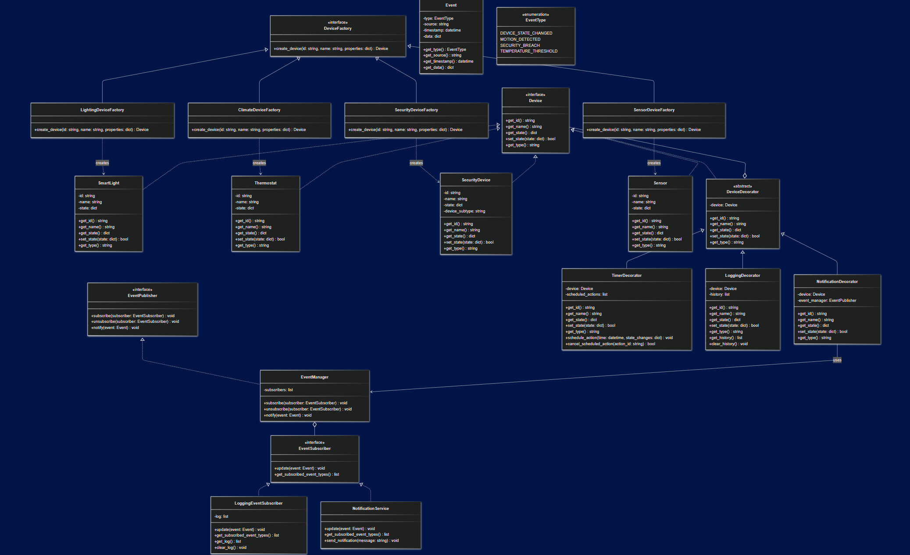

# Smart Home Automation System

A Python-based smart home automation system that demonstrates the implementation of three Gang-of-Four design patterns.

## Project Purpose & Scope

This project simulates a smart home automation system that allows users to:
- Control various smart devices (lights, thermostats, security cameras, etc.)
- Create and manage automation rules
- Monitor and respond to events in the home environment

The system is designed to demonstrate key software design patterns and principles while providing a realistic implementation scenario.

## Design Patterns Implemented

### 1. Factory Method (Creational Pattern)

**Intent**: Define an interface for creating an object, but let subclasses decide which class to instantiate. Factory Method lets a class defer instantiation to subclasses.

**Implementation**:
- `DeviceFactory`: Abstract factory interface for creating smart home devices
- Concrete factories: `LightingDeviceFactory`, `ClimateDeviceFactory`, etc.
- Each factory creates specific device types while following a common interface

### 2. Decorator (Structural Pattern)

**Intent**: Attach additional responsibilities to an object dynamically. Decorators provide a flexible alternative to subclassing for extending functionality.

**Implementation**:
- Base `Device` component interface
- Concrete components: `SmartLight`, `Thermostat`, etc.
- Decorators: `TimerDecorator`, `SecurityDecorator`, `EnergyMonitorDecorator`, etc.
- Each decorator adds specific functionality to base devices (scheduling, security features, energy monitoring)

### 3. Observer (Behavioral Pattern)

**Intent**: Define a one-to-many dependency between objects so that when one object changes state, all its dependents are notified and updated automatically.

**Implementation**:
- `EventPublisher` subject interface
- Concrete subjects: `HomeSecuritySystem`, `EnvironmentalMonitor`
- `EventSubscriber` observer interface
- Concrete observers: `NotificationService`, `AutomationEngine`, `LoggingService`
- When events occur in the home, relevant services respond appropriately

## Design Principles Applied

### SOLID Principles

1. **Single Responsibility Principle**: Each class has one reason to change (e.g., device classes handle device operations, automation rules handle conditions and actions).

2. **Open/Closed Principle**: System is open for extension but closed for modification (new device types can be added without changing existing code).

3. **Liskov Substitution Principle**: Any derived class can be substituted for its base class (e.g., any device implementation can be used where Device interface is expected).

4. **Interface Segregation Principle**: Clients are not forced to depend on interfaces they don't use (separate interfaces for different device capabilities).

5. **Dependency Inversion Principle**: High-level modules depend on abstractions, not concrete implementations (automation engine works with device interfaces, not specific device classes).

## Setup and Usage

### Requirements
- Python 3.8 or higher
- pytest (for running tests)

### Installation
```bash
# Clone the repository
git clone https://github.com/yourusername/smart-home-automation.git

# Navigate to project directory
cd smart-home-automation

# Install dependencies (if any)
pip install -r requirements.txt
```

### Running the Application
```bash
# Run the application in CLI mode
python -m src.main

# Run the application with GUI interface
python -m src.main --gui
```

### Running Tests
```bash
# Run all tests
pytest

# Run tests with coverage report
pytest --cov=src --cov-report=term --cov-report=xml:coverage.xml
```

## Project Structure
```
.
├── README.md
├── requirements.txt
├── docker-compose.yml
├── coverage.xml
├── sonar-project.properties
├── wait_for_sonar.sh
├── src/
│   ├── __init__.py
│   ├── main.py
│   └── smart_home/
│       ├── __init__.py
│       ├── automation/
│       │   └── event_system.py
│       ├── devices/
│       │   ├── __init__.py
│       │   ├── base_devices.py
│       │   ├── device_decorators.py
│       │   └── device_factories.py
│       ├── gui/
│       │   ├── __init__.py
│       │   └── main_gui.py
│       └── interfaces/
│           ├── __init__.py
│           ├── device.py
│           └── event.py
└── tests/
    ├── conftest.py
    ├── test_decorators.py
    ├── test_factories.py
    ├── test_gui.py
    └── test_observer.py
```

## UML Diagrams

To visualize the system's architecture and design patterns, here's the UML diagram:
